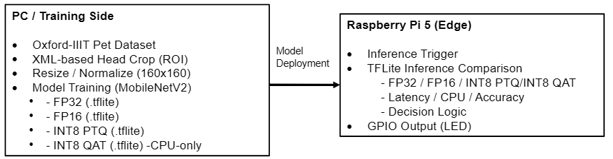

# **Edge AI model optimization and deployment on Raspberry Pi 5**
## Executive Summary

This project demonstrates an end-to-end edge AI workflow, from model training and quantization on PC to real-time inference deployment on Raspberry Pi 5.
Multiple TensorFlow Lite models (FP32, FP16, INT8 PTQ, INT8 QAT) are systematically compared in terms of latency, CPU usage, and inference accuracy.
The project focuses on practical engineering trade-offs in edge deployment rather than achieving maximum model accuracy.
A lightweight GPIO-based LED output is used to visualize inference decisions on-device.
This repository is intended as a hands-on portfolio project for embedded / edge AI engineering roles.

## Raspberry Pi 5 上的 Edge AI 模型最佳化與部署 (案例研究：貓 / 狗 影像分類)

本專案展示一個完整的 Edge AI 工作流程，重點放在 模型最佳化、部署，以及在 Raspberry Pi 5 上的效能比較。

與其打造一個完整的消費性產品，本專案刻意將主軸放在：

- 原始資料集的前處理流程
- 模型訓練與不同量化策略之四種模型格式：
    - FP32
    - FP16
    - INT8 (Post-Training Quantization, PTQ)
    - INT8 (Quantization-Aware Training, QAT)
- 在資源受限的邊緣裝置上進行推論
- 比較並量測：
    - 推論延遲(latency)
    - CPU 使用率
    - 分類準確率
- 驗證 `tflite-runtime` 在邊緣裝置上的實務限制
- 整合 GPIO 輸出，以 LED 顯示推論結果

貓 / 狗分類僅作為案例情境，用來探討實務中 Edge AI 系統的取捨與限制。

## 系統架構


## Demo video (Edge Inference on Raspberry Pi)
Demo 影片展示於 RaspberryPi 5 上之即時離線推論。推論結果直接對應 GPIO 控制之 LED 以得到即時硬體回應。

https://youtube.com/shorts/biKfEp-H_zw

## 模型訓練（PC 端）
### 資料集
- Oxford-IIIT Pet Dataset
- 使用官方提供的 XML 標註進行辨視用區域 ROI 裁切
- 分類類別：
    - cats
    - dogs
    - others
### 基礎模型
- MobileNetV2（ImageNet 預訓練權重）
- 輸入尺寸：160 × 160

### 模型最佳化策略
本專案刻意同時保留 FP32 作為基準模型，以量化不同模型最佳化策略在邊緣裝置上的實際影響。

| 模型類型     | 方法             |
| -------- | -------------- |
| FP32     | 基準模型           |
| FP16     | 訓練後 float16 轉換 |
| INT8 PTQ | 使用代表資料集進行量化    |
| INT8 QAT | 量化感知訓練（CPU）    |

## 邊緣裝置推論（Raspberry Pi 5）
### 推論框架
`tflite-runtime`
### 比較指標
- 平均推論延遲（毫秒）
- 延遲標準差
- CPU 使用率
- 分類準確率

所有模型皆使用相同推論流程，以確保比較公平性。

### GPIO 輸出（LED 對應）
推論結果以三顆 LED 顯示：
| 分類 | GPIO 腳位 | LED |
|------|-------|-----|
| cats   | GPIO 16 | 紅色 |
| dogs   | GPIO 20 | 黃色 |
| others | GPIO 21 | 綠色 |

每次推論僅點亮對應類別的一顆 LED。
```
說明：
本專案使用 LED 作為最小化的硬體回饋介面，用以驗證：
- 邊緣推論結果與實體 GPIO 控制的整合流程
- 推論決策與硬體輸出之即時性

實際的餵食機構或機械致動元件刻意未納入設計範圍，以避免硬體設計掩蓋 Edge AI 模型效能比較的主軸。
```
## 測試與開發硬體環境（Reference）
### 模型訓練用 PC:
- Laptop: MSI GP62 2QE
- GPU: NVIDIA (2GB VRAM)
- OS: Windows

### 邊緣裝置:
- Raspberry Pi 5
- OS: Raspberry Pi OS (64-bit)

## 軟體元件
### PC 端
- Python >= 3.8
- TensorFlow
- TensorFlow Model Optimization Toolkit
- OpenCV
- NumPy
- Matplotlib
### Raspberry Pi 5 端
- Python >= 3.9
- tflite-runtime
- lgpio
- NumPy
- OpenCV
- psutil
- Matplotlib

Raspberry Pi 上 不需要安裝 TensorFlow。

PC 與 Raspberry Pi 5 端的軟體環境刻意分離，以符合實務中「模型訓練與邊緣部署」的典型工作流程。

補充說明：
- 模型訓練主要使用 TensorFlow GPU 版本
- CUDA / cuDNN 版本依使用者系統環境而異，未強制綁定
- 若 GPU 記憶體不足，QAT 可改以 CPU-only 模式執行（本專案已實際驗證）

## 啟動順序
1. 對 Oxford-IIIT Pet Dataset 進行辨視用大頭照裁切 [Cropping_Group.py]
2. 縮小大頭照/對照用之其他室內照片至統一尺寸 160x160 [resize.py]
3. 分類訓練及產生模型檔 (FP32/FP16/INT8 PTQ) [Training.py]
4. 產生模型檔 INT8 QAT [QAT_CPU.py]
5. 執行推論 [inference.py]


## 系統行為

- 推論完全於 Raspberry Pi 5 上進行 (非雲端推論)
- 推論用資料完全於 Raspberry Pi 5 上處理
- 分類結果以 GPIO 輸出對應
- LED 狀態反應即時推論結果

本設計專注於 low-latency 邊緣推論而非用戶端之 UI。這種最小化的硬體回饋機制，能在不引入額外 I/O 或機械變數的情況下，評估推論效能與系統延遲。


## 觀察與結論
- FP16 在 CPU 使用率上通常優於 FP32，且準確率相近
- INT8 PTQ 可能因量化 / 反量化成本而增加延遲
- INT8 QAT 可提升量化模型穩定性，但在 CPU 上不一定優於 FP16
- 模型最佳化效果與實際硬體平台高度相關

以上結果顯示，模型最佳化策略的效益高度依賴實際部署平台，無法僅依理論或單一指標做判斷。

## 設計決策 & 已知限制
### 設計取捨說明
- 未實作實際餵食機構
- 未使用實體感測器作為推論觸發
- 專注於**模型效能與邊緣部署限制**的工程層面
- 此取捨使專案更適合用來展示工程能力，而非產品雛形。

### 未來延伸（選擇性）
- 加入感測器或按鈕作為推論觸發
- 整合相機進行即時影像推論
- 匯出效能比較結果為 CSV
- 與 GPU / NPU 加速器進行比較

----
## 檔案目錄結構
```text
Edge_AI_model_optimization/
├── docs/
│   ├── wiring.md
│   ├── requirements.txt
│   └── system_architecture.png
│
├── edge_inference/
│   ├── inference.py             # RPi5 推論與效能比較
│   └── class_indices.json       # 推論分類之標示
│
├── models/
│   ├── pet_classifier_fp32.tflite
│   ├── pet_classifier_fp16.tflite
│   ├── pet_classifier_int8_PTQ.tflite
│   └── pet_classifier_int8_QAT_CPU.tflite
│
├── pc_pipeline/
│   ├── Cropping_Group.py        # 依 XML 標註進行 ROI 裁切
│   ├── resize.py                # 影像調整為 160x160
│   ├── Training.py              # FP32 / FP16 / PTQ 模型訓練
│   └── QAT_CPU.py               # CPU 上進行 INT8 QAT
│
├── screenshots_demo
│   └── inference_summary.png    # 推論 summary 截圖
│
├── validation_backup/           # 推論用驗證照片
│
└── README.md

```

## License Notice

The source code in this repository is released under the MIT License.

Demo materials, including videos, photos, logs, and generated data under the following directories are provided for demonstration purposes only and are NOT covered by the MIT License:

- screenshots_demo/

These materials may not be redistributed or reused without explicit permission.