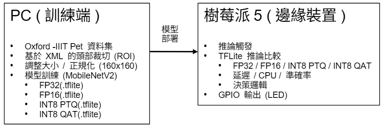

# 邊緣 AI 視覺推論最佳化與部署  
(Raspberry Pi 5 / Jetson Nano – 工程案例研究)

> 核心問題：在 2GB 記憶體 GPU 裝置上，GPU 加速是否真的能降低事件驅動型推論的實際延遲？

---

## 專案概述

本專案是一個端到端的邊緣 AI 工程案例研究，從模型訓練與量化，到嵌入式裝置部署與系統層級行為分析。說明了**模型最佳化、runtime 狀態，以及系統記憶體限制**如何共同決定邊緣裝置上的真實推論效能。

與追求最高 FPS 不同，本專案聚焦於：

- 事件驅動 (batch=1) 推論場景
- 冷啟動延遲成本
- 記憶體限制對 runtime 行為的影響
- CPU 與 GPU 在實際部署下的取捨

測試任務：貓 / 狗 / 其他 影像分類 (160×160 RGB)

測試平台：

- Raspberry Pi 5 (4GB) – TensorFlow Lite (CPU, XNNPACK)
- Jetson Nano (2GB) – TensorRT (GPU)

---

## 主要工程發現

- Raspberry Pi 5 提供穩定且可預測的延遲行為。
- Jetson Nano 在 2GB 記憶體限制下，效能受 runtime 初始化與系統狀態顯著影響。
- GPU 加速 ≠ 一定更低延遲。
- 冷啟動成本在事件觸發型應用中具有關鍵影響。

---

## 結果快照（Batch = 1）

| 平台 | 冷啟動 | 穩態延遲 | 關鍵特性 |
|------|--------|----------|----------|
| RPi5 (CPU) | ~15 ms | ~12 ms | 穩定、可預測 |
| Jetson Nano (GPU) | 1.4–10 秒 | 15–25 ms | Runtime & 記憶體主導 |

### Quantitative Takeaways

- Jetson Nano 冷啟動延遲為 RPi5 的約 100–700 倍。
- 記憶體最佳化後，Jetson 平均延遲由 ~45ms 改善至 ~15–25ms。
- 冷啟動延遲主要由 TensorRT engine 載入與 CUDA context 初始化主導。

---

## Demo（Raspberry Pi 5）

展示從感知 → 推論 → 硬體動作的完整閉環，模擬實際邊緣設備中的即時控制流程。

https://youtube.com/shorts/biKfEp-H_zw

---

## 系統概覽

- 任務：貓 / 狗影像分類
- 輸入：160×160 RGB
- 推論模式：事件驅動 (batch=1)
- 重點：延遲、冷啟動、記憶體限制



---

# 工程比較與洞察

## 1. Raspberry Pi 5 — TensorFlow Lite (CPU)

| 精度 | 冷啟延遲 (ms) | 平均延遲 (ms) | 準確率 |
|------|---------------|---------------|--------|
| FP32 | ~14.6 | ~12.4 | 1.000 |
| FP16 | ~15.1 | ~12.4 | 1.000 |
| INT8 PTQ | ~20.9 | ~21.4 | 0.9969 |
| INT8 QAT | ~33.6 | ~21.3 | 0.9907 |

**觀察：**

- 延遲高度穩定
- 量化在 CPU 上不保證加速
- 適合長時間穩定運行

---

## 2. Jetson Nano (2GB) — TensorRT (GPU)

### 記憶體最佳化前

| 精度 | 冷啟延遲 (ms) | 平均延遲 (ms) |
|------|---------------|---------------|
| FP16 | ~5,596 | ~43.1 |
| FP32 | ~10,976 | ~45.5 |

### 記憶體最佳化後

| 精度 | 冷啟延遲 (ms) | 平均延遲 (ms) |
|------|---------------|---------------|
| FP16 | ~1,411–6,019 | ~15–26 |
| FP32 | ~1,443–7,215 | ~16–32 |

**Runtime 關鍵洞察：**

- 記憶體與 workspace 設定顯著影響 engine 行為。
- 冷啟動由 CUDA context 初始化主導。
- FP16 不一定在所有 runtime 狀態下優於 FP32。
- 在 2GB RAM 下，batch=1 是較穩定的部署選擇。

---

# 工程結論

- 在低記憶體 GPU 裝置上，系統行為往往比模型精度更影響延遲。
- 冷啟動延遲在事件驅動系統中不可忽略。
- 可預測性與部署穩定性往往比峰值吞吐量更重要。

---

## Deployment & Reproducibility

本專案另提供 Docker 容器化部署版本，以確保：

- 依賴版本一致性
- 可重現執行環境
- 跨裝置部署一致性

Companion repository:  
https://github.com/gogohusky-lgtm/Edge_AI_Inference_dockerized

---

## 方法論與完整基準測試

完整結果請參考：

- `benchmarks/edge_inference.csv`
- `benchmarks/methodology.md`

---

## GPIO 硬體回饋 (RPi5)

| 類別 | GPIO 腳位 | LED |
|------|----------|-----|
| 貓 | GPIO 16 | 紅色 |
| 狗 | GPIO 20 | 黃色 |
| 其他 | GPIO 21 | 綠色 |

---

## 檔案目錄結構

```text
Edge_AI_model_optimization/
├── benchmarks/
│   ├── edge_inference.csv
│   └── methodology.md
│
├── docs/
│   ├── wiring.md
│   ├── requirements.txt
│   ├── system_arch.png
│   └── system_architecture.png
│
├── edge_inference/
│   ├── inference.py             # RPi5 推論與效能
│   ├── RPi5_inference.py        # 推論比較用(RPi5端)
│   ├── Jetson_inference.py      # 推論比較用(Jetson端)
│   └── class_indices.json       # 推論分類之標示
│
├── models/
│   ├── pet_classifier_fp32.tflite
│   ├── pet_classifier_fp16.tflite
│   ├── pet_classifier_int8_PTQ.tflite
│   ├── pet_classifier_int8_QAT_CPU.tflite
│   ├── fp16.trt                 # 優化後FP16 engine
│   └── fp32.trt                 # 優化後FP32 engine
│
├── pc_pipeline/
│   ├── Cropping_Group.py        # 依 XML 標註進行 ROI 裁切
│   ├── resize.py                # 影像調整為 160x160
│   ├── Training.py              # FP32 / FP16 / PTQ 模型訓練
│   └── QAT_CPU.py               # CPU 上進行 INT8 QAT
│
├── screenshots_demo
│   ├── Comp_RPi5_summary.png        # 推論比較 summary 截圖 (RPi5端)
│   ├── Comp_Jetson_bfr_summary.png  # 優化前推論比較 summary 截圖 (Jetson端)
│   ├── Jetson_run-1.txt             # 優化後推論比較綜整 (Jetson端,CLI[1]~[4],Desktop[5], FP16先跑)
│   ├── Jetson_run-2.txt             # 優化後推論比較綜整 (Jetson端,CLI[1]~[4],Desktop[5], FP32先跑)
│   ├── Comp_Jetson_aft_summary-1.png  # 優化後推論比較截圖 (Jetson端，Desktop, FP16先跑)
│   ├── Comp_Jetson_aft_summary-2.png  # 優化後推論比較截圖 (Jetson端，Desktop, FP32先跑)
│   └── RPi5_inference_GPIO.png        # RPi5 (GPIO) 推論 summary 截圖
│
├── validation_backup/           # 推論用驗證照片
│
└── README.md
```

## License

The source code in this repository is released under the MIT License.

Demo materials, including videos, photos, logs, and generated data under the following directories are provided for demonstration purposes only and are NOT covered by the MIT License:

screenshots_demo/

These materials may not be redistributed or reused without explicit permission.

