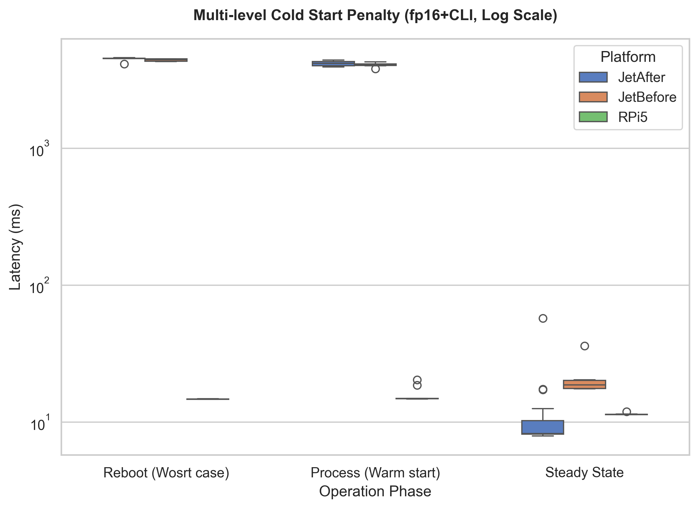
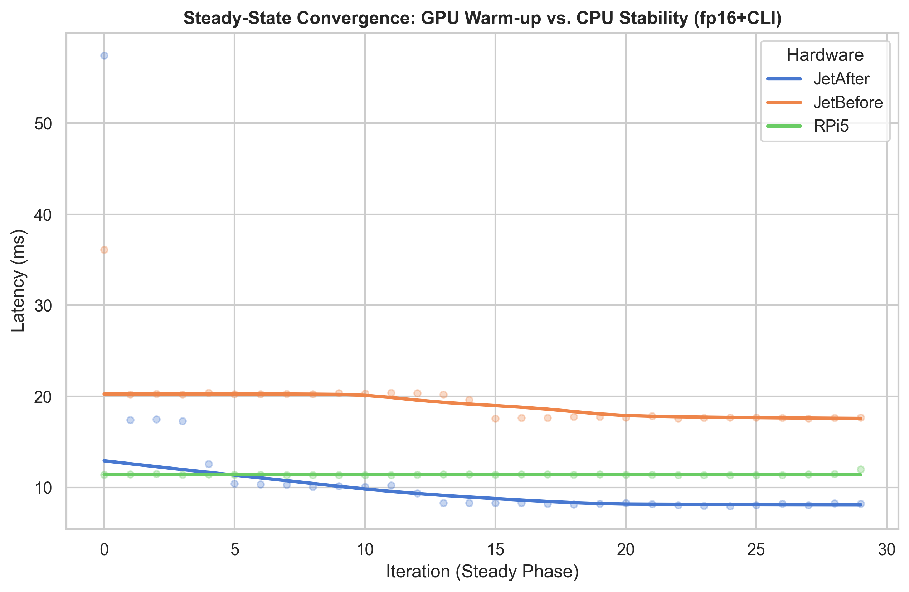

# 邊緣 AI 視覺推論最佳化與部署  
(Raspberry Pi 5 / Jetson Nano – 工程案例研究)

> 核心問題：在 2GB 記憶體 GPU 裝置上，GPU 加速是否真的能降低事件驅動型推論的實際延遲？

> 結論顯示：在低記憶體 GPU 裝置上，冷啟動成本往往主導事件驅動型應用的實際延遲，GPU 並非必然更快。

## 專案概述

本專案是一個端到端的邊緣 AI 工程案例研究，涵蓋：
- 模型訓練、量化與優化
- 嵌入式裝置部署 (RPi5 / Jetson Nano)
- 系統層級行為觀察（延遲、冷啟動、記憶體使用）

焦點不在追求最高 FPS，而是 事件驅動 (batch=1) 場景的延遲穩定性：
- 冷啟動延遲成本
- Steady-state 延遲收斂
- 記憶體限制下的 Runtime 行為
- CPU vs GPU 實際部署差異

測試任務：貓 / 狗 / 其他 影像分類 (160×160 RGB)

測試平台：

- Raspberry Pi 5 (4GB) – TensorFlow Lite (CPU, XNNPACK)
- Jetson Nano (2GB) – TensorRT (GPU)

## 專案分兩部份
## Part I. RPi5 Sense-to-Action 展示

Demo（Raspberry Pi 5）

展示從感知 → 推論 → 硬體動作的完整閉環，模擬實際邊緣設備中的即時控制流程。

https://youtube.com/shorts/biKfEp-H_zw


| 精度 | 冷啟延遲 (ms) | 平均延遲 (ms) | 準確率 |
|------|---------------|---------------|--------|
| FP32 | ~14.6 | ~12.4 | 1.000 |
| FP16 | ~15.1 | ~12.4 | 1.000 |
| INT8 PTQ | ~20.9 | ~21.4 | 0.9969 |
| INT8 QAT | ~33.6 | ~21.3 | 0.9907 |

觀察：
- 延遲高度穩定、可預測
- CPU 上量化未必能加速
- 適合長時間穩定運行的邊緣任務

## Part II. RPi5 vs Jetson Nano 性能比較
- 比較RPi5, Jetson 記憶體優化前(JetBefore), Jetson 記憶體優化後(JetAfter)之推論效能
- 分析 reboot / process cold 與 steady latency
- 強調記憶體與 runtime 行為對事件驅動延遲的影響

工程決策指引
- Raspberry Pi 5 提供穩定且可預測的延遲行為。
- Jetson Nano 在 2GB 記憶體限制下，效能受 runtime 初始化與系統狀態顯著影響。
- 冷啟動成本在事件觸發型應用中具有關鍵影響。

---

### 結果快照（Batch = 1）
1. 冷啟動成本
- Jetson Nano 快，但對 Reboot_cold (初次啟動) / Process_cold (Warm start) 非常敏感
- RPi5 steady latency 穩定，冷啟動成本小



2. 穩態的 Warm-up 效應
- Jetson Nano 在 steady phase 表現優勢，但前 5 次 warm-up 波動較大
- RPi5 延遲平滑，收斂迅速且穩定



3. 平台層級之 Memory Footprint (Steady Batch)
- 數值代表批次初始化階段的佔用量變化，而非每次迭代的波動。
- 此數值為平台初始化策略的觀察結果，並非應用程式可直接控制之參數。
- 此表格補充圖 1 與圖 2，展示平台層級的資源管理行為。

| Platform   |   Mem_Delta (MB) | 狀態 |
|-----------|------------|---|
| JetAfter   |         -51 |積極回收記憶體|
| JetBefore  |           7 |輕微增加|
| RPi5       |          36 |大部分被保留|


4. 系統反應效率 Summary
- Jetson：Cold start 成本是 steady 的 200~500 倍
- RPi5：Cold start 幾乎沒有成本差異。

| Platform   |   Reboot_Cold (ms) |   Process_Cold (ms) |   Steady_Late (ms) |  Reboot/Steady_Ratio |   Process/Steady_Ratio |
|------------|-------------------|--------------------|-------------------|--------------------|-----------------------|
| JetAfter   |            4476.11 |             4166.58 |               8.79 |               509.2 |                  473.9 |
| JetBefore  |            4418.14 |             4078.76 |              18.69 |               236.4 |                  218.2 |
| RPi5       |              14.77 |               15.81 |              11.41 |                 1.3 |                    1.4 |


### 主要工程結論
- 在 batch=1 事件驅動場景下，GPU 的 steady latency 優勢會被 cold start 成本放大抵消。
- 在低記憶體 GPU 裝置（2GB）上，runtime 初始化成本是主導因素。
- 若系統頻繁啟動/零星啟動，CPU 平台可能更合適。
- 若為高 throughput、長時間運行場景，GPU steady phase 才會展現優勢。

---

## 系統概覽

- 任務：貓 / 狗影像分類
- 輸入：160×160 RGB
- 推論模式：事件驅動 (batch=1)
- 重點：延遲、冷啟動、記憶體限制


## Deployment & Reproducibility

本專案另提供 Docker 容器化部署版本，以確保：

- 依賴版本一致性
- 可重現執行環境
- 跨裝置部署一致性

Companion repository:  
https://github.com/gogohusky-lgtm/Edge_AI_Inference_dockerized

---

## 方法論與完整 Benchmark 測試

完整結果請參考：

- `benchmarks/master.csv`
- `benchmarks/benchmark_design.md`

---

## GPIO 硬體回饋 (RPi5)

| 類別 | GPIO 腳位 | LED |
|------|----------|-----|
| 貓 | GPIO 16 | 紅色 |
| 狗 | GPIO 20 | 黃色 |
| 其他 | GPIO 21 | 綠色 |

---

## 檔案目錄結構

```text
Edge_AI_model_optimization/
│
├── benchmarks/
│   ├── master.csv
│   └── benchmark_design.md
│
├── docs/
│   ├── mem_log_fp16_CLI.txt     # 推論記錄 Log(CLI)
│   ├── mem_log_fp16_Desktop.txt # 推論記錄 Log(Desktop)
│   ├── process_CLI.sh           # shell script 範例 (process_CLI)
│   ├── wiring.md
│   ├── system_architecture.png
│   ├── Fig1_cold_breakdown.png
│   ├── Fig2_convergence_curve.png
│   ├── 20260217_10h48m03s_grim.png  # RPi5 desktop 推論截圖範例
│   └── session_fp32.log         # Jetson CLI 推論 script log 範例
│
├── edge_inference/
│   ├── inference.py             # Sense-to-action RPi5 推論與效能
│   ├── infer_RPi5.py            # 推論比較用(RPi5端)
│   ├── infer_Jetson.py          # 推論比較用(Jetson端)
│   ├── list.json                # 推論比較用檔案 list
│   └── class_indices.json       # 推論分類之標示
│
├── models/
│   ├── pet_classifier_fp32.tflite
│   ├── pet_classifier_fp16.tflite
│   ├── pet_classifier_int8_PTQ.tflite
│   ├── pet_classifier_int8_QAT_CPU.tflite
│   ├── fp16.trt                 # 優化後FP16 engine
│   └── fp32.trt                 # 優化後FP32 engine
│
├── pc_pipeline/
│   ├── Training.py              # FP32 / FP16 / PTQ 模型訓練
│   └── QAT_CPU.py               # INT8 QAT
│
├── validation_backup/           # 推論用驗證照片
│
└── README.md
```

## License

The source code in this repository is released under the MIT License.

Demo materials, including videos, photos, logs, and generated data under the following directories are provided for demonstration purposes only and are NOT covered by the MIT License:

docs/

These materials may not be redistributed or reused without explicit permission.

